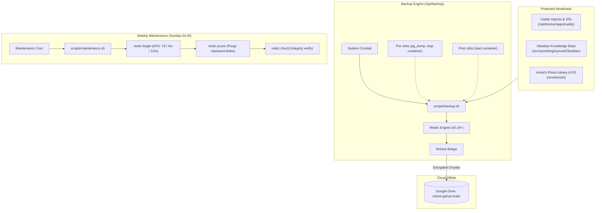

# Automated Homelab Backup Framework

> Robust, encrypted, deduplicated offsite backup pipeline using [Restic](https://restic.net/) and [Rclone](https://rclone.org/).  
> Targets cloud offsite storage (Google Drive) with pre/post-job hooks and automated GFS retention.

---

## 1. Architecture Overview



---

## 2. Directory Structure

```text
.
├── AGENTS.md                  # Operational standards for AI agents
├── README.md                  # Human-oriented documentation & runbooks
├── roles/                     # Engineering role guides (bash-script-writer, system-admin)
├── scripts/
│   ├── backup.sh              # Core incremental backup runner
│   ├── maintenance.sh         # Weekly retention (forget), prune, and integrity check
│   ├── config.env.example     # Configuration template (Zero-Secret)
│   ├── lib/
│   │   ├── log.sh             # Standard ISO-8601 logging
│   │   └── ntfy-backup-notifications.sh # Sanitized ntfy notification module
│   ├── pre-jobs/              # Database dump and pre-backup hooks
│   └── post-jobs/             # Service restart hooks
└── recovery-codes/            # Standalone recovery credentials backup
```

---

## 3. Configuration & Prerequisites

All sensitive credentials reside **outside** this git repository:

1. **Restic Password**: `/root/.resticpasswd` (Permissions: `0400`)
2. **Repository Pointer**: `/root/.resticrepo` (e.g. `rclone:gdrive:restic`)
3. **Rclone Config**: `/root/.config/rclone/rclone.conf` (Permissions: `0600`)
4. **Notifications (Optional)**: Set `NTFY_URL` in environment or save URL in `/root/.backup_ntfy_url`.

---

## 4. Usage

### A. Run a Manual Backup
```bash
# Standard directory backup
/opt/backup/scripts/backup.sh /path/to/source <tag>

# Backup with container pre/post hooks (e.g. database consistency)
/opt/backup/scripts/backup.sh /srv/immich immich \
  --pre-job "/opt/backup/scripts/pre-jobs/stop-container.sh immich_server" \
  --pre-job "/opt/backup/scripts/pre-jobs/postgresql-dump.sh immich_postgres /srv/immich/library/backups/immich-database.sql.gz" \
  --post-job "/opt/backup/scripts/post-jobs/start-container.sh immich_server"
```

### B. Run Repository Maintenance (Retention & Prune)
```bash
/opt/backup/scripts/maintenance.sh
```

---

## 5. Crontab Schedule Reference

```cron
# ==============================================================================
# Nightly Incremental Backups
# ==============================================================================
06 00 * * * /opt/backup/scripts/backup.sh /opt/docker/apps/caddy caddy >> /var/log/caddy-backup.log 2>&1
15 00 * * * /opt/backup/scripts/backup.sh /srv/syncthing/synced/Obsidian obsidian >> /var/log/syncthing-obsidian-backup.log 2>&1

# ==============================================================================
# Weekly Maintenance (Retention, Pruning, Integrity Check)
# ==============================================================================
30 04 * * 0 /opt/backup/scripts/maintenance.sh >> /var/log/restic-maintenance.log 2>&1
```

---

## 6. Disaster Recovery & Restores

### List Snapshots
```bash
restic snapshots
```

### Restore Entire Snapshot
```bash
restic restore <SNAPSHOT_ID> --target /tmp/restore-target
```

### Restore Specific Directory or File
```bash
restic restore <SNAPSHOT_ID> --include /opt/docker/apps/caddy --target /tmp/restore-target
```